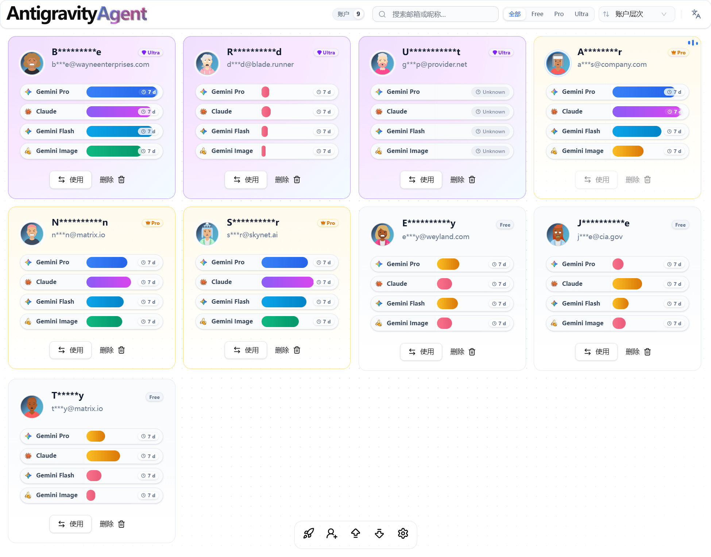
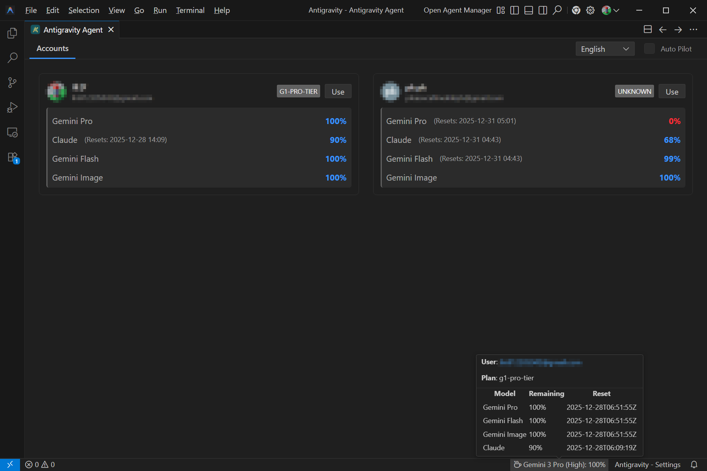

# Antigravity Agent

[English](docs/README.en.md) | 简体中文

**轻松管理您的 Antigravity 多账户**

 

 

[下载安装](../../releases)

---

> [!WARNING]
> 本软件仅通过 [GitHub Releases](https://github.com/MonchiLin/antigravity-agent/releases) 官方渠道分发。  
> 由于涉及账户敏感信息，请勿从其他来源下载，以确保您的数据安全。

---

> [!TIP]
> **Antigravity 扩展已上线！** 从 1.6.0 版本起，您可以安装 [Antigravity 扩展](https://open-vsx.org/extension/MonchiLin/antigravity-agent)，在编辑器内切换账户、实时当前对话和所有模型配额，仅需后台运行 Antigravity Agent 即可。

## 功能概览

<table>
<tr>
<td width="50%">

### 快速切换
在多个账户间一键切换，无需重复登录

</td>
<td width="50%">

### 自动记录
自动识别当前账户并保存

</td>
</tr>
<tr>
<td width="50%">

### 安全备份
通过密码加密导出账户配置，支持跨设备迁移

</td>
<td width="50%">

### VSCode 扩展
在编辑器内切换账户、查看模型配额

</td>
</tr>
</table>

---

## 使用说明

<b>添加新账户</b>

 

1. 点击 **登录新账户** 按钮
2. 确认后，当前账户数据将被清除
3. 在自动打开的 Antigravity 中登录新账户，账户信息将自动保存

---

## 路线图

| 状态 | 计划 |
|:----:|------|
| - | 账户层级 |
| - | 暗色主题 |
| - | 开发流程规范化 |
| - | 版本更新日志 |
